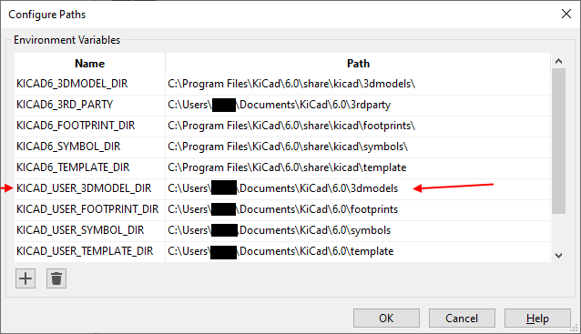

# KiCad 3D Models
common 3D models, which are used in my KiCad 6.x projects

if you use one of my KiCad 6.x projects out of my repo list (https://github.com/analoghifi?tab=repositories),  
you will find that not all of the 3D models are the KiCad default 3D models.  
  
To get a proper 3D view in KiCad just download all the 3D-Models (step and wrl version each) from this repo into a local path on your PC  
and then create a new environment variable in KiCad (under "Preferences" -> "Configure Paths" -> "Environment Variables") named "KICAD_USER_3DMODEL_DIR" and set it to this local path, where your stored all the 3D-Models from this repo.  
  
the environment variable "KICAD_USER_3DMODEL_DIR" is referenced in all my KiCad projects (in the \*.kicad_pcb files) when using (my own) 3D models that are not standard KiCad 3D models...
   
----   
   

